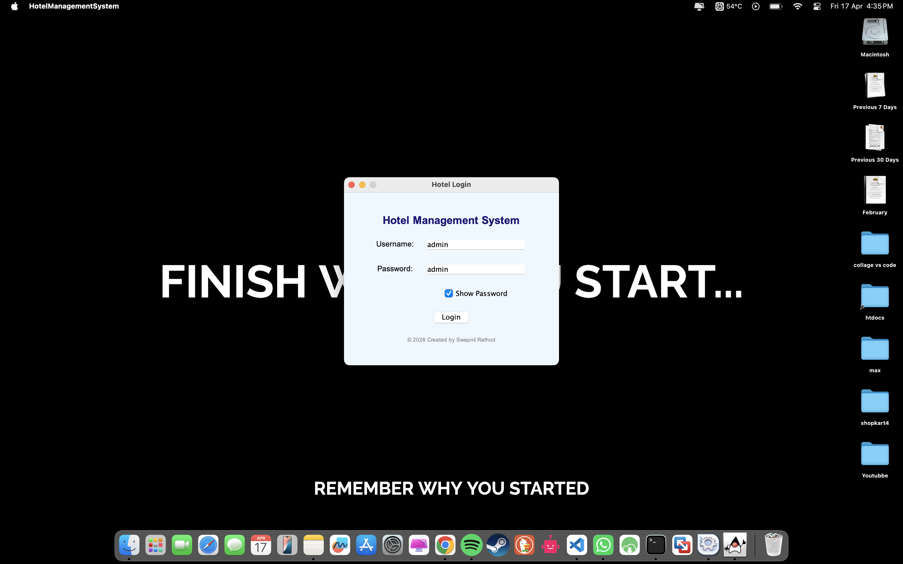
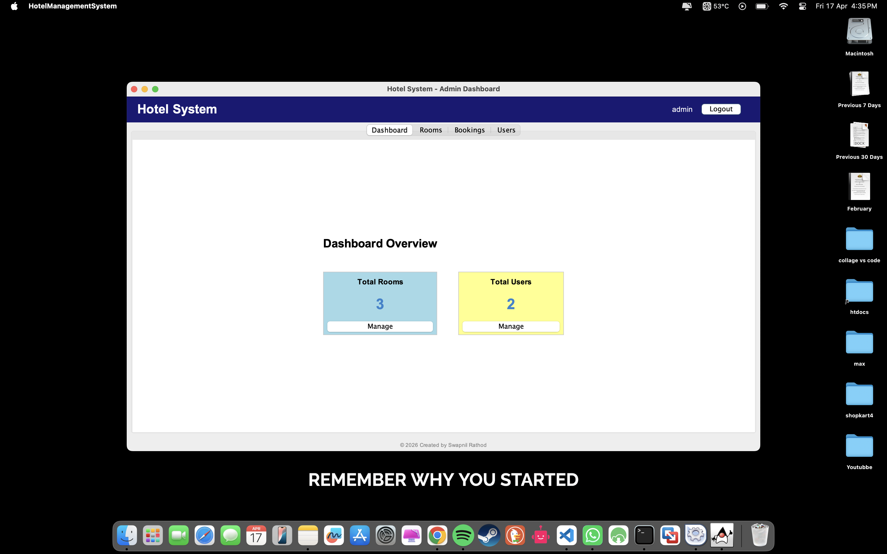
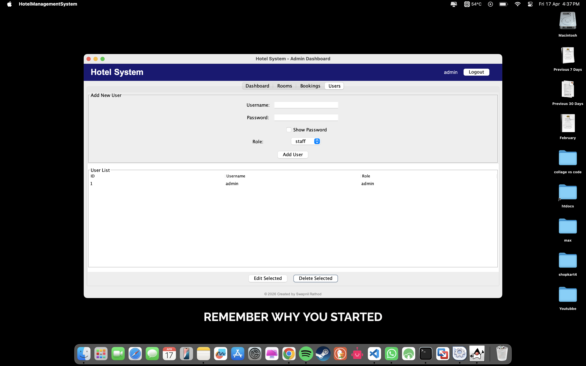
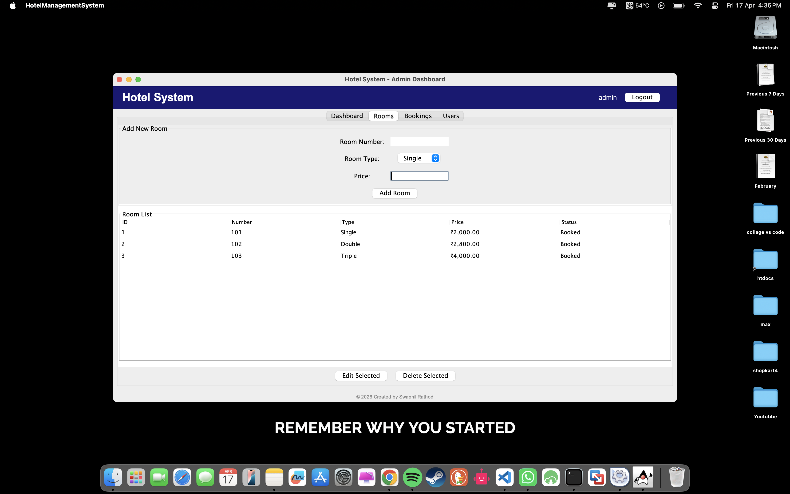
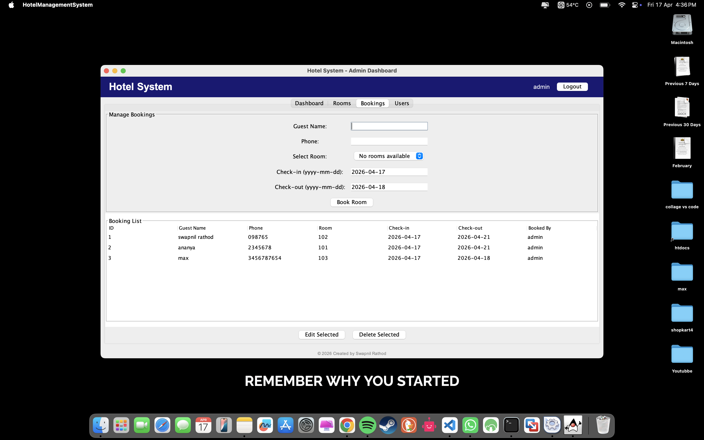
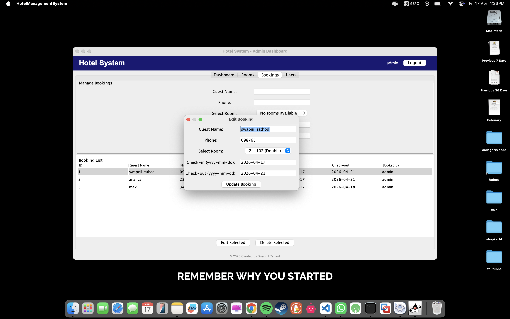

# Hotel Management System

A complete Java desktop application for managing hotel rooms, bookings, and users. Built with **Java Swing** for the GUI and **SQLite** for the database. Includes separate dashboards for **Admin** and **Staff** roles.

## Folder Structure
```bash

hotel-management-system/
├── HotelManagementSystem.java
│   sqlite-jdbc-3.42.0.0.jar                       
└── README.md
```

## Features

### Admin Dashboard
- **Dashboard Overview** – Total rooms, bookings, users (colour‑coded stat cards: blue, green, yellow).
- **Room Management** – Add, edit, delete rooms. Room status (Available/Booked) is calculated automatically based on current date.
- **Booking Management** – Create, edit, delete bookings.  
  - Room dropdown shows **only rooms available** for the selected date range.  
  - Phone number field accepts **only digits** (max 10 characters).  
  - Prevents double‑booking for overlapping dates.
- **User Management** – Add, edit, delete staff/admin users.  
  - “Show Password” checkbox for password fields.

### Staff Dashboard
- Limited access: Dashboard (room & booking counts) and Bookings management (create, edit, delete bookings).

### Login Screen
- Admin default credentials: `admin` / `admin`
- “Show Password” checkbox.

### Database
- **SQLite** – automatically creates `hotel.db` on first run.
- Sample data (rooms, bookings) is inserted automatically.

## Screenshots
- **Login page** 




- **Admin Dashboard page** 




- **Manage Users page** 




- **Manage Rooms page** 




- **Manage Rooms Edit page** 


- **Manage Booking page** 




- **Manage Bookings Edit page** 




## **Intro how to setup after download**

[)](https://youtu.be/lkSRut0UpIk?si=z_PMDQV2CZz7Chue)


## Requirements

- **Java JDK 8 or higher**
- **SQLite JDBC driver** (included as an external JAR)

## Setup & Installation

### 1. Download the SQLite JDBC Driver

Download `sqlite-jdbc-3.42.0.0.jar` from:  
[https://repo1.maven.org/maven2/org/xerial/sqlite-jdbc/3.42.0.0/sqlite-jdbc-3.42.0.0.jar](https://repo1.maven.org/maven2/org/xerial/sqlite-jdbc/3.42.0.0/sqlite-jdbc-3.42.0.0.jar)

Place the `.jar` file in the **same folder** as `HotelManagementSystem.java`.

### 2. Compile the Code

Open a terminal/command prompt in that folder.

**Path** 
```
C:\Users\swapnil\Downloads\HotelSystem
```

**Windows:**

```cmd
javac -cp ".;sqlite-jdbc-3.42.0.0.jar" HotelManagementSystem.java

java -cp ".;sqlite-jdbc-3.42.0.0.jar" HotelManagementSystem
```

**Path** 
```
/Users/apple/Downloads/HotelSystem
```

**macOS/Linux:**

```bash
javac -cp ".:sqlite-jdbc-3.42.0.0.jar" HotelManagementSystem.java

java -cp ".:sqlite-jdbc-3.42.0.0.jar" HotelManagementSystem

```
